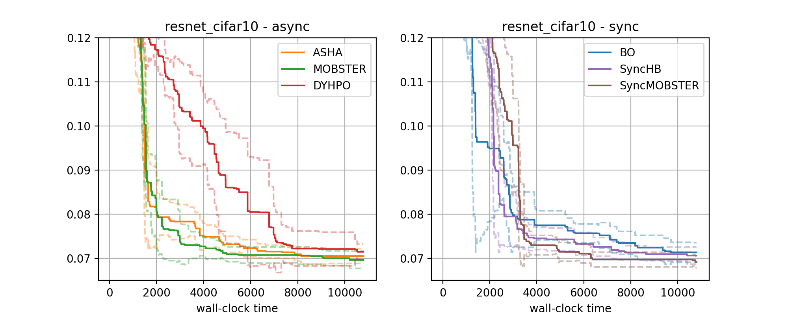

Tuning your Deep Learning Model
===============================

Syne Tune provides a wide range of state of the art algorithms for tuning models
which are expensive to train. It is backend-agnostic, which allows you to easily
switch between:

* *Local backend*: Tuning a model on a single instance, using the different
  GPUs or CPUs as workers which run in parallel
* *SageMaker backend*: Tuning a model on any number of instances, making use
  of all instance types and frameworks AWS SageMaker offers
* *Simulator backend*: For a growing number of tabulated (or surrogate)
  benchmarks, tuning methods can be compared at very low cost, and orders of
  magnitude faster than real time

In this demo, we will focus on *local backend* and *SageMaker backend*. Details
about the simulator backend are provided `here <../benchmarking/bm_simulator.html>`_.

You can create your own specific tuning setup from scratch, using one of our
`examples <../../examples.html>`_ to get started. However, it is often simpler to
use the :mod:`benchmarking` formalism, whose default scripts incorporate a lot
of best practices. While benchmarking makes it very easy to compare several
tuning methods on a number of benchmarks, it can just as well simplify running
a single experiment. For a more through discussion of benchmarking, you can work
through `this tutorial <../benchmarking/README.html>`_.

Annotating the Training Script
------------------------------

We will walk through an example of comparing 6 methods on the
:mod:`~benchmarking.commons.benchmark_definitions.resnet_cifar10` benchmark.
In this example, we tune 4 hyperparameters of a ResNet-18 model trained on the
CIFAR-10 dataset. Since both model and dataset are fairly small, we use the
local backend, which has fewer delays and is cheaper to run. The full training
script is
`resnet_cifar10.py <../../training_scripts.html#resnet-18-trained-on-cifar-10>`_.

The script is a fairly typical example for SageMaker training code, annotated in
a small way in order to enable automated tuning. First, we specify the
hyperparameters to be tuned, and their respective data types, in the
*configuration space*:

.. literalinclude:: ../../../../benchmarking/training_scripts/resnet_cifar10/resnet_cifar10.py
   :caption: resnet_cifar10.py -- configuration space
   :lines: 28-48

In this example, we tune ``batch_size`` with integer values in :math:`[8, 256]`,
the learning rate ``lr`` with real values in :math:`[0.001, 0.1]`, as well as
``momentum`` and ``weight_decay`` with respective bounds. Also, ``lr`` and
``weight_decay`` are encoded on a logarithmic scale. Choosing a configuration
space is an important part of HPO tuning, some guidelines are available
`here <../../search_space.html>`_. Note that the configuration space need not
be defined in the training script (which only needs to know the names of the
hyperparameters), but for example benchmarks like ``resnet_cifar10``, it is
good practice to do so. In fact, ``_config_space`` is a default suggestion,
which can be modified by the user.

The script receives hyperparameters and additional parameters as command line
arguments:

.. literalinclude:: ../../../../benchmarking/training_scripts/resnet_cifar10/resnet_cifar10.py
   :caption: resnet_cifar10.py -- command line arguments
   :lines: 271-281

If the configuration space is defined in the script, you can use
:func:`~syne_tune.config_space.add_to_argparse` to add hyperparameters to the
argument parser. An important additional argument is ``epochs``, which is the
maximum number of epochs to train for. Finally,
:func:`~benchmarking.utils.add_checkpointing_to_argparse` is part of checkpointing,
which is discussed below. At the end, we call :code:`objective(config=vars(args))`,
which executes training and reporting of metrics.

Here is the code for the training objective:

.. literalinclude:: ../../../../benchmarking/training_scripts/resnet_cifar10/resnet_cifar10.py
   :caption: resnet_cifar10.py -- training objective
   :lines: 196-230

* Towards the end, we loop over training epochs. For each epoch, the model is
  trained with a SGD optimizer, and the validation error is computed afterwards.
  Next, a checkpoint is written (more details below). Finally, we report metric
  values back to Syne Tune, via the ``report`` callback. The report is a
  dictionary, containing the objective value and also the epoch number.
* Inserting the ``report`` callback is the most important modification you need
  for a training script to become tunable. If possible, report in regular
  intervals during training, for example after every epoch. While basic HPO
  algorithms like random search or Bayesian optimization only use a single
  report at the end, there are more performant methods which can stop or
  pause training early.
* At the start of the script, data is downloaded, split into training and
  validation set, and data loaders (i.e., mini-batch iterators) are set up.
  Since several processes may do this at the same time, this is protected by
  a file lock.
* Next, we create the objects ``model``, ``optimizer``, and ``scheduler``.
  The first maintains the ML model and its weights, the latter two parameterize
  the SGD optimizer and learning rate scheduler. All of them have a mutable
  state.
* Finally, this benchmark supports *checkpointing*, in that the mutable state
  is written at the end of each epoch. Some HPO algorithms make good use of
  checkpointing, so we recommend to implement it, but it is not mandatory.
  Syne Tune provides
  `tooling for writing and reading checkpoints <../../faq.html#how-can-i-enable-trial-checkpointing>`_.

Turning the Training Script into a Benchmark
--------------------------------------------

Next, in order to enable your tuning problem in ``benchmarking``, you need to
provide some meta-data. For our ``resnet_cifar10`` example, this is:

.. literalinclude:: ../../../../benchmarking/commons/benchmark_definitions/resnet_cifar10.py
   :caption: commons/benchmark_definitions/resnet_cifar10.py
   :lines: 13-69

A benchmarks is specified in terms of a
:class:`~benchmarking.commons.benchmark_definitions.common.RealBenchmarkDefinition`
object. It contains:

* Mandatory information: ``script``, ``metric``, ``mode``, ``resource_attr``,
  ``max_resource_attr``. Where is the training script, and what metrics does it
  report? ``mode`` is ``"max"`` or ``"min"``, depending on whether the objective
  ``metric`` is to be maximized or minimized. ``max_resource_attr`` is the name
  of the parameter for the maximum number of epochs (which is ``"epochs"`` in
  our example). It is good practice to import this information from the training
  script file (e.g., ``METRIC_NAME``, ``RESOURCE_ATTR``).
* SageMaker framework: ``framework``, ``estimator_kwargs``. Selects the SageMaker
  framework for your code, and allows to specify extra arguments for the
  estimator.
* Default values: ``config_space``, ``max_wallclock_time``, ``n_workers``,
  ``instance_type``. Your benchmark should come with a configuration space, a
  wallclock time for the whole experiment, and a suggestion for AWS instance
  type and number of workers (i.e., evaluations running in parallel). All of these
  can be overwritten by the user.

In our example, we implement a function
:func:`~benchmarking.commons.benchmark_definitions.resnet_cifar10.resnet_cifar10_benchmark`,
which maps some arguments to a ``RealBenchmarkDefinition`` instance:

* In particular, we adjust defaults defaults depending on whether the SageMaker
  backend is used, or the local one. For the latter, all worker processes run on
  a single instance, so to support ``n_workers=4``, we need to use an instance
  with at least 4 GPUs (and set ``num_gpus=1``). On the other hand, for the
  SageMaker backend, different workers use their own instance, so we can use a
  cheaper instance type with a single GPU.

Scripts for Experiments
-----------------------

Syne Tune's benchmarking package is supposed to work mostly out of the box for
the common tuning modalities, but at the same time can be deeply configured.

First, we need to specify which methods to compare with each other.

.. literalinclude:: ../../../../benchmarking/nursery/tmlr_experiments/tmlr4/baselines.py
   :caption: benchmarking/nursery/tmlr_experiments/tmlr4/baselines.py
   :lines: 13-

* Methods are configured by command line arguments, which are collected in
  ``method_arguments``. Just select methods you want from
  :mod:`benchmarking.commons.default_baselines`. For arguments not covered in
  ``method_arguments``, defaults are used
* You can change defaults here (e.g., ``type="promotion"``), and use different
  values for different ``methods`` entries
* All methods you specify here, will be compared against each other. In this
  example, we compare 6 methods

Next, we need to specify the benchmarks on which methods should be compared.
This is done in terms of a function with signature

.. code-block:: python

   def benchmark_definitions(
       sagemaker_backend: bool = False, **kwargs
   ) -> Dict[str, RealBenchmarkDefinition]

Since ``resnet_cifar10`` is one of the real benchmarks coming with Syne Tune,
we can just import
:func:`~benchmarking.commons.benchmark_definitions.real_benchmark_definitions.real_benchmark_definitions`,
which allows all built-in real benchmarks to be selected.

Now, we need code to run the tuning experiment on a local instance:

.. literalinclude:: ../../../../benchmarking/nursery/tmlr_experiments/tmlr4/hpo_main.py
   :caption: benchmarking/nursery/tmlr_experiments/tmlr4/hpo_main.py
   :lines: 13-

* Just include your methods and benchmarks definitions, and call some common
  code (namely, :func:`benchmarking.commons.hpo_main_local.main` for the local
  backend).
* This code runs all experiments locally, each method for each benchmark.
  With ``--method``, you can select a method, with ``--benchmark`` a benchmark.
* If defaults do not work for you, you can specify extra command line arguments,
  see `benchmarking/nursery/benchmark_hypertune/hpo_main.py <../../benchmarking/benchmark_hypertune.html>`_
  for an example.

Running experiments with ``hpo_main.py`` is good for small comparisons running
locally, but all experiments are run in sequence, and they run on the machine
you are on, which may not have the right setup. In our example, we certainly do
not want to get through the trouble of starting a SageMaker notebook instance
of the desired instance type and install all our code on there, and repeat this
for every experiment we want to run in parallel. For anything more serious,
it is convenient to *launch experiments remotely*:

.. literalinclude:: ../../../../benchmarking/nursery/tmlr_experiments/tmlr4/launch_remote.py
   :caption: benchmarking/nursery/tmlr_experiments/tmlr4/launch_remote.py
   :lines: 13-

* Again, you import your methods and benchmarks definitions, and then call some
  common code (namely,
  :func:`benchmarking.commons.launch_remote_local.launch_remote` for the local
  backend).
* This code is going to run experiments in parallel, as SageMaker training jobs.
  The entry point for these training jobs is the ``hpo_main.py`` script you saw
  above
* All other specifications happen behind the scenes. For example, the instance
  type or experiment run-time are specified by the benchmark (as shown below).
  All of these can be changed by command line arguments, but we use the defaults
  here.
* Experiments for different methods and random repetitions (seeds) are run in
  parallel. The launcher script requires a single benchmark to be specified.
  For our comparison we have 6 methods, and we run 10 random repetitions. This
  means 60 SageMaker training jobs will be launched in parallel.

Running and Results
-------------------

Let us run this:

.. code-block:: bash

   python benchmarking/nursery/tmlr_experiments/tmlr4/launch_remote.py \
     --experiment_tag demo_offsite_local --benchmark resnet_cifar10 \
     --num_seeds 1

In order to save time, we only launch one random repetition (seed). Still, these
are 6 SageMaker training jobs, one for each method. Let us have a look at
the *SageMaker Console*.

I ran all of this beforehand:

* 60 jobs in parallel, each running on a ``ml.g4dn.12xlarge`` instance, where
  each of the 4 GPUs is allocated to one worker, so that 4 workers can run
  in parallel
* Results of each experiment are stored to S3, for later analysis

Experiments used ``max_wallclock_time`` of 3 hours. We can now look at a
comparative plot.

+-----------------------------------------------------+
| |Result resnet_cifar10|                             |
+=====================================================+
| Comparison of methods (left: async; right: sync) on |
| resnet_cifar10 benchmark.                           |
+-----------------------------------------------------+

* For each method, we show the interquartile mean in bold and a bootstrap
  confidence interval in dashed, using the 10 repetitions.
* ``BO`` (Bayesian optimization) does not stop training runs early. It typically
  performs worse than multi-fidelity methods, which can pause trials early and
  only resume training for the most promising ones.
* ``SyncHB`` and ``SyncMOBSTER`` synchronize their decision-making, in that
  resume decisions are made only when a number of trials reached a certain point.
  In general, they tend to be outperformed by asynchronous methods, for which
  decisions are done instantly whenever a worker becomes available.
* Model-based multi-fidelity methods (``MOBSTER``) typically work somewhat
  better than such based on random search (``ASHA``), even though in our
  current example, this difference is not significant.
* ``DyHPO`` is a recent model-based multi-fidelity method, which can work very
  well, but sometimes does not work well at all (as in our example here).
  It deserves further study.
