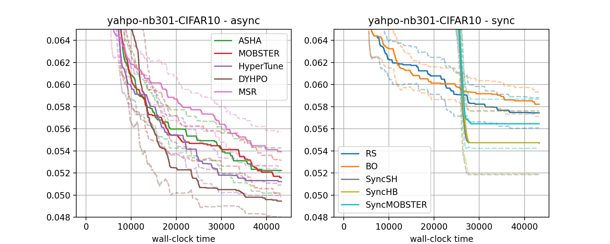

Comparison of Methods on Surrogate Benchmarks
=============================================

Say your team provides tuning or training services to customers. You want to
make sure:

* Your solution performs well when compared to a range of baselines
* New ideas of your scientists can be evaluated very rapidly (since most ideas
  do not work)
* You want to make sure your solutions do not degrade (integration and
  regression testing)

With Syne Tune's support for simulating tuning experiments on tabulated or
surrogate benchmarks, you can:

* Run comparisons between any set of supported tuning methods orders of
  magnitude faster than real time
* Run your experiments in parallel, in order to finish in hours rather than
  days

Scripts
-------

For a more through discussion of benchmarking, you can work through
`this tutorial <../benchmarking/README.html>`_. We will walk through an
example of comparing 10 methods on 13 surrogate benchmarks, which is part of
a forthcoming journal submission.

Syne Tune's benchmarking package is supposed to work mostly out of the box for
the common tuning modalities, but at the same time can be deeply configured.

First, we need to specify which methods to compare with each other.

.. literalinclude:: ../../../../benchmarking/nursery/tmlr_experiments/tmlr-3/baselines.py
   :caption: benchmarking/nursery/tmlr_experiments/tmlr-3/baselines.py
   :lines: 13-

* Methods are configured by command line arguments, which are collected in
  ``method_arguments``. Just select methods you want from
  :mod:`benchmarking.commons.default_baselines`. For arguments not covered in
  ``method_arguments``, defaults are used
* You can change defaults here (e.g., ``type="promotion"``), and use different
  values for different ``methods`` entries
* All methods you specify here, will be compared against each other. In this
  example, we compare 10 methods: 7 asynchronous and 3 synchronous ones

Next, we need to specify the benchmarks on which methods should be compared:

.. literalinclude:: ../../../../benchmarking/nursery/tmlr_experiments/surrogate_benchmark_definitions.py
   :caption: benchmarking/nursery/tmlr_experiments/surrogate_benchmark_definitions.py
   :lines: 13-

* Syne Tune provides a number of benchmarks ready to use, in
  :mod:`benchmarking.commons.benchmark_definitions`.
* You can either selected surrogate benchmarks, or real benchmarks. For a
  *real benchmark*, each evaluation of a hyperparameter configuration requires
  model training. Comparisons are fully realistic, but they also take a long
  time and high costs to get done.
* In a *surrogate benchmark*, the mapping from hyperparameter configuration to
  evaluation metrics is provided by an interpolation model or look-up table,
  fit to lots of evaluations for a particular problem. Creating a surrogate
  benchmark takes substantial computation efforts, but once it is done, it can
  be used over and over, and by many people. More and more surrogate benchmarks
  get released by the research community.
* Syne Tune provides the best support of experimentation with surrogate
  benchmarks among all open source libraries we are aware of.
* In this example, we select 13 surrogate benchmarks from 4 benchmark families
  integrated in Syne Tune.

Now, we need code to run the tuning experiment on a local instance:

.. literalinclude:: ../../../../benchmarking/nursery/tmlr_experiments/tmlr-3/hpo_main.py
   :caption: benchmarking/nursery/tmlr_experiments/tmlr-3/hpo_main.py
   :lines: 13-

* Just include your methods and benchmarks definitions, and call some common
  code
* This code runs all experiments locally, running each method for each benchmark.
  With ``--method``, you can select a method, with `--benchmark`` a benchmark
* If defaults do not work for you, you can specify extra command line arguments,
  see `benchmarking/nursery/benchmark_hypertune/hpo_main.py <../../benchmarking/benchmark_hypertune.html>`_
  for an example

Running experiments with ``hpo_main.py`` is good for small comparisons running
locally, but all experiments are run in sequence, and they run on the machine
you are on, which may not have the right setup (e.g., real benchmarks often need
GPUs). For anything more serious, it is more convenient to *launch experiments
remotely*:

.. literalinclude:: ../../../../benchmarking/nursery/tmlr_experiments/tmlr-3/launch_remote.py
   :caption: benchmarking/nursery/tmlr_experiments/tmlr-3/launch_remote.py
   :lines: 13-

* Again, you import your methods and benchmarks definitions, and then call some
  common code
* This code is going to run experiments in parallel, as SageMaker training jobs.
  The entry point for these training jobs is the ``hpo_main.py`` script you saw
  above
* All other specifications happen behind the scenes. For example, the instance
  type or experiment run-time are specified by the benchmark (as shown below).
  All of these can be changed by command line arguments, but we use the defaults
  here.
* Many experiments are run in parallel:

  * Different methods are run in parallel
  * Random repetitions (seeds) are run in parallel for methods in
    ``is_expensive_methods``, otherwise they run in sequence
  * Different benchmarks are run in sequence (but for large benchmark families,
    this can be changed as well)

  For our comparison we have 10 methods, 5 of which are *expensive*, 13 benchmarks,
  and we run 30 random repetitions. This means 5 * 30 + 5 = 155 SageMaker training
  jobs will be launched in parallel.

Running and Results
-------------------

Let us run this:

.. code-block:: bash

   python benchmarking/nursery/tmlr_experiments/tmlr3/launch_remote.py \
     --experiment_tag demo_offsite --num_seeds 1

In order to save time, we only launch one random repetition (seed). Still, these
are 10 SageMaker training jobs, one for each method. Let us have a look at
the *SageMaker Console*.

I ran all of this beforehand:

* 5 * 30 + 5 = 155 jobs in parallel, each running on cheap CPU instances
* The total number of experiments is 10 * 13 * 30 = 3900
* This is all done in maybe 2 hours, even if some benchmarks have real
  wallclock times of 45 hours, and some of the methods evaluate 100s of
  trials
* Results of each experiment are stored to S3, for later analysis

We can now look at some comparative plots. The first is for the
``nas201-cifar100`` benchmark, with a real wall-clock time of 5 hours.

.. |Result nas201-cifar100| image:: img/tmlr3_nas201-cifar100.png

+-----------------------------------------------------+
| |Result nas201-cifar100|                            |
+=====================================================+
| Comparison of methods (left: async; right: sync) on |
| nas201-cifar100 benchmark.                          |
+-----------------------------------------------------+

The second is for the ``yahpo-nb301-CIFAR10`` benchmark, which has a larger
search space, and real wall-clock time was of 12 hours.

+-----------------------------------------------------+
| |Result yahpo-nb301-CIFAR10|                        |
+=====================================================+
| Comparison of methods (left: async; right: sync) on |
| yahpo-nb301-CIFAR10 benchmark.                      |
+-----------------------------------------------------+

* For each method, we show the interquartile mean in bold and a bootstrap
  confidence interval in dashed, using the 30 repetitions.
* ``RS`` and ``BO`` do not stop training runs early. They typically perform worse
  than multi-fidelity methods, which can pause trials early and only resume
  training for the most promising ones
* ``SyncSH``, ``SyncHB``, and ``SyncMOBSTER`` synchronize their decision-making,
  in that resume decisions are made only when a number of trials reached a
  certain point. They exhibit step-wise curves, where improvements are only made
  shortly after synchronizations points. Asynchronous methods (left) typically work
  better
* Model-based multi-fidelity methods (``MOBSTER``, ``HyperTune``) typically work
  better than such based on random search (``ASHA``). Older heuristics like
  median stopping rule (``MSR``) are typically outperformed
* ``DyHPO`` is a recent model-based multi-fidelity method, which can work very
  well (e.g., ``yahpo-nb301-CIFAR10``), but sometimes does not work well at all
  (e.g., ``nas201-cifar100``)
