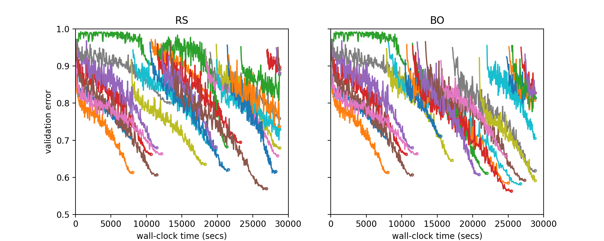

What Is New in Syne Tune?
=========================

We would like to end this overview with pointing out new contributions to Syne
Tune. If any of them (or anything else) resonates with you, please do not
hesitate to get in touch.

Documentation
-------------

The documentation of Syne Tune is hosted now on ``readthedocs`` and has been much
improved. We provide many examples, a comprehensive FAQ, as well as a growing number
of tutorials. Two of these tutorials are from external contributors:

* `Progressive ASHA <tutorials/pasha/pasha.html>`_, contributed by
  `Ondre <https://github.com/ondrejbohdal>`_.
* HIER!

Here is a per-trial plot for random search (RS) and Bayesian optimization (BO),
where the learning curve of each trial has a different color.

+--------------------------------------------------------+
| |fifo_nas201-ImageNet16-120|                           |
+========================================================+
| Learning curves for each trial, for random search (RS) |
| and Bayesian optimization (BO).                        |
+--------------------------------------------------------+

* Both BO and RS train every trial for the full number of epochs (200). Since we use
  8 workers, and full training can require more than 10000 seconds, the initial part
  of the plots are the same (recall they share the same random seed).
* Still, BO has a slight edge and tends to start trials later one which perform
  better, while RS simply starts trials with randomly chosen configurations

Asynchronous Multi-Fidelity: ASHA and MOBSTER
---------------------------------------------

Here is the same plot for two asynchronous multi-fidelity methods. Both:

* pause trials early (at certain rung levels) and only resume trials which outperform
  most others at the same number of epochs
* make decisions whenever a worker becomes available, instead of synchronizing decisions
  until many competing trials reached the same number of epochs

However, ``ASHA`` chooses configurations for new trials at random (like ``RS``), while
``MOBSTER`` uses multi-task Bayesian optimization for such decisions (like ``BO``).

.. |multifid_nas201-ImageNet16-120| image:: img/demo_offsite_multifid_nas201-ImageNet16-120.png

+-------------------------------------------------------+
| |multifid_nas201-ImageNet16-120|                      |
+=======================================================+
| Learning curves for each trial, for ASHA and MOBSTER. |
+-------------------------------------------------------+

* ASHA and MOBSTER train fewer trials for the full number of epochs, while most trials
  are paused early and never resumed. This way, they find significantly better solutions
  in the limited time of the experiment
* MOBSTER manages to start more well-performing trials in the latter half of the
  experiment, and wastes less time on starting trials which do not get far due to a poor
  configuration. The Bayesian optimization mechanism of MOBSTER rapidly learns what not
  to do, while ASHA continues to sample poor configurations at a fixed rate
