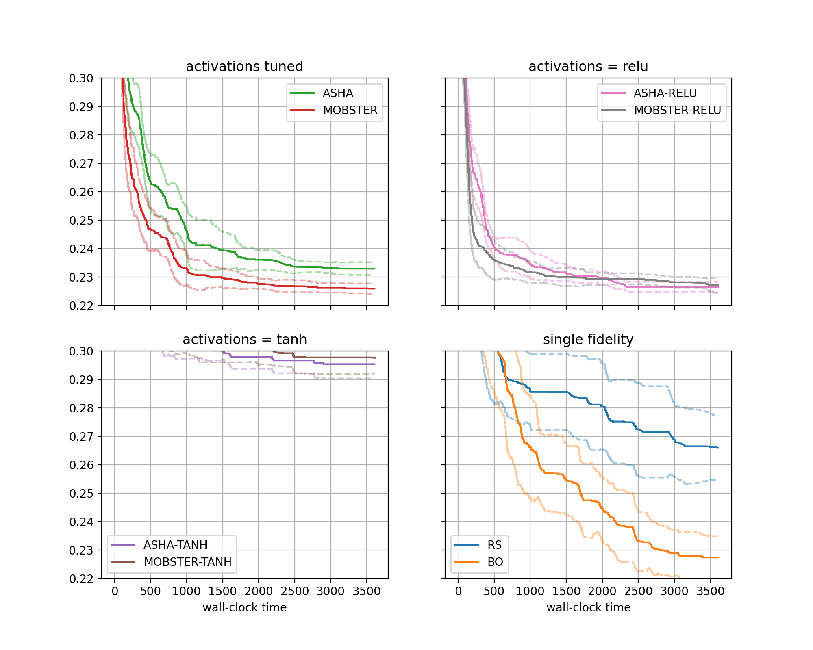

Visualization of Results
========================

Once all results are obtained, we would rapidly like to create comparative
plots. In Syne Tune, each experiment stores two files, ``metadata.json`` with
metadata, and ``results.csv.zip`` containing time-stamped results. The
:class:`~syne_tune.Tuner` object at the end of the experiment is also
serialized to ``tuner.dill``, but this is not needed here.

.. note::
   This section offers an example of the plotting facilities in Syne Tune. A
   more comprehensive tutorial is forthcoming.

First, we need to download the results from S3 to the local disk. This can be
done by a command which is also printed at the end of ``launch_remote.py``:

.. code-block:: bash

   aws s3 sync s3://<BUCKET-NAME>/syne-tune/docs-2/ ~/syne-tune/docs-2/ \
     --exclude "*" --include "*metadata.json" --include "*results.csv.zip"

This command can also be run from inside the plotting code. Note that the
``tuner.dill`` result files are not downloaded, since they are not needed for
result visualization.

Here is the code for generating result plots for two of the benchmarks:

.. literalinclude:: ../../../../benchmarking/nursery/demo_experiment/plot_results.py
   :caption: benchmarking/nursery/demo_experiment/plot_results.py
   :start-after: # permissions and limitations under the License.

The figure for benchmark ``fcnet-protein`` looks as follows:

+-------------------------------------+
| |Results for fcnet-protein|         |
+=====================================+
| Results for FCNet (protein dataset) |
+-------------------------------------+

Moreover, we obtain an output for extra results, as follows:

.. code-block:: bash

   [ASHA]:
     num_at_level1: [607, 630, 802, 728, 669, 689, 740, 837, 786, 501, 642, 554, 625, 531, 672]
     num_at_level3: [234, 224, 273, 257, 247, 238, 271, 287, 272, 185, 227, 195, 216, 197, 241]
     num_at_level9: [97, 81, 99, 95, 99, 99, 106, 99, 98, 74, 86, 78, 82, 85, 101]
     num_at_level27: [49, 36, 37, 36, 41, 47, 37, 39, 39, 39, 44, 41, 30, 45, 49]
     num_at_level81: [22, 17, 18, 15, 21, 22, 19, 13, 23, 27, 29, 20, 17, 20, 26]
   [MOBSTER]:
     num_at_level1: [217, 311, 310, 353, 197, 96, 377, 247, 282, 175, 302, 187, 225, 182, 240]
     num_at_level3: [107, 133, 124, 138, 104, 64, 163, 123, 112, 110, 129, 90, 100, 86, 126]
     num_at_level9: [53, 62, 55, 59, 66, 51, 83, 54, 51, 72, 65, 60, 49, 55, 70]
     num_at_level27: [29, 34, 30, 26, 50, 37, 49, 27, 28, 49, 33, 42, 27, 34, 45]
     num_at_level81: [18, 20, 16, 14, 33, 25, 37, 17, 20, 32, 24, 29, 15, 26, 31]
   [ASHA-TANH]:
     num_at_level1: [668, 861, 755, 775, 644, 916, 819, 769, 710, 862, 807, 859, 699, 757, 794]
     num_at_level3: [237, 295, 265, 272, 221, 311, 302, 276, 240, 297, 290, 304, 258, 270, 279]
     num_at_level9: [86, 112, 101, 97, 91, 104, 119, 98, 90, 108, 120, 105, 109, 105, 102]
     num_at_level27: [37, 47, 39, 39, 40, 39, 45, 44, 40, 45, 43, 38, 53, 49, 39]
     num_at_level81: [21, 16, 16, 16, 20, 16, 17, 21, 20, 17, 19, 16, 19, 23, 20]
   [MOBSTER-TANH]:
     num_at_level1: [438, 594, 462, 354, 307, 324, 317, 516, 391, 408, 565, 492, 322, 350, 479]
     num_at_level3: [166, 206, 156, 135, 133, 127, 129, 178, 169, 151, 204, 164, 122, 132, 205]
     num_at_level9: [69, 75, 56, 54, 78, 60, 57, 72, 103, 67, 77, 63, 48, 59, 92]
     num_at_level27: [36, 35, 25, 28, 45, 37, 27, 37, 58, 31, 36, 26, 28, 33, 39]
     num_at_level81: [20, 13, 12, 11, 23, 20, 13, 18, 31, 16, 18, 11, 16, 19, 21]
   [ASHA-RELU]:
     num_at_level1: [599, 670, 682, 817, 608, 585, 770, 618, 718, 613, 674, 715, 638, 598, 652]
     num_at_level3: [201, 246, 242, 277, 225, 209, 282, 215, 245, 207, 239, 238, 224, 221, 234]
     num_at_level9: [75, 94, 94, 100, 89, 92, 101, 80, 98, 86, 96, 83, 84, 90, 91]
     num_at_level27: [37, 43, 36, 34, 40, 45, 39, 38, 39, 35, 34, 29, 34, 41, 35]
     num_at_level81: [23, 19, 14, 13, 19, 21, 15, 19, 18, 20, 16, 13, 15, 22, 17]
   [MOBSTER-RELU]:
     num_at_level1: [241, 319, 352, 438, 354, 386, 197, 359, 401, 334, 294, 361, 403, 178, 141]
     num_at_level3: [110, 156, 135, 166, 138, 143, 104, 133, 151, 130, 122, 134, 151, 92, 74]
     num_at_level9: [50, 83, 59, 75, 59, 55, 57, 62, 63, 61, 54, 52, 65, 48, 47]
     num_at_level27: [31, 51, 29, 31, 29, 23, 39, 32, 29, 32, 29, 24, 27, 31, 34]
     num_at_level81: [20, 35, 12, 11, 12, 15, 22, 16, 15, 20, 15, 15, 13, 18, 22]

More details about plotting are given in
`this tutorial <../benchmarking/bm_plotting.html#visualization-of-results>`__.
Here, we only explain our specific example:

* There are four subfigures arranged as two-by-two matrix. Each contains two
  curves in bold, along with confidence intervals. The horizontal axis
  depicts wall-clock time, and on the vertical axis, we show the best
  metric value found until this time.
* More general, the data from our 480 experiments can be grouped w.r.t.
  subplot, then *setup*. Each setup gives rise to one curve (bold, with
  confidence band). Subplots are optional, the default is to plot a single
  figure.
* The function ``metadata_to_setup`` maps the metadata stored for an experiment
  to the setup name, or to ``None`` if this experiment should be filtered out.
  In our basic case, the setup is simply the name of the method.
  Our benchmarking framework stores a host of information as metadata, some
  useful keys for grouping are:

  * ``algorithm``: Name of method (``ASHA``, ``MOBSTER``, ... in our example)
  * ``tag``: Experiment tag. This is ``docs-2`` in our example. Becomes useful when
    we merge data from different studies in a single figure

* Once the data is grouped w.r.t. benchmark, then subplot (optional), then
  setup, we should be left with 20 experiments, one for each seed. These 20
  curves are now interpolated to a common grid, and at each grid point, the
  20 values are aggregated into ``lower``, ``aggregate``, ``upper``. In the
  figure, ``aggregate`` is shown in bold, and ``lower``, ``upper`` in dashed.
  Different aggregation modes are supported (selected by
  ``plot_params.aggregate_mode``):

* Plotting starts with the creation of a
  :class:`~syne_tune.experiments.ComparativeResults` object. We need to
  pass the experiment names (or tags), the list of all setups, the number of
  runs (or seeds), the ``metadata_to_setup`` function, as well as default
  plot parameters in ``plot_params``. See
  :class:`~syne_tune.experiments.PlotParameters` for full details about the
  latter. In our example, we set ``xlabel``, ``aggregate_mode`` (see above),
  and enable a grid with ``grid=True``. Note that these parameters can be
  extended and overwritten by parameters for each plot.
* In our example, we group setups into four different subfigures, for better
  visibility. This is done by specifying
  ``plot_params.subplots`` and ``metadata_to_subplot``. In the former,
  ``plot_params.subplots.kwargs`` is mandatory, we need the number of
  rows ``nrows`` and columns ``ncols`` of the subplot arrangement.
  In ``plot_params.subplots.titles``, we can provide titles for each
  subfigure, and ``plot_params.subplots.legend_no=[0, 1, 2, 3]`` asks for
  legends in all subplots. For full details about these
  arguments, see :class:`~syne_tune.experiments.SubplotParameters`
* The creation of ``results`` does a number of things. First, if
  ``download_from_s3=True``, result files are downloaded from S3. In our
  example, we assume this has already been done. Next, all result files are
  iterated over, all ``metadata.json`` are read, and an inverse index from
  benchmark name to paths, ``setup_name``, and ``subplot_no`` is created.
  This process also checks that exactly ``num_runs`` experiments are present
  for every setup. For large studies, it frequently happens that too few
  or too many results are found. The warning outputs can be used for
  debugging.
* Given ``results``, we can create plots for every benchmark. In our example,
  this is done for ``fcnet-protein`` and ``fcnet-slice``, by
  calling ``results.plot()``. Apart from the benchmark name, we also pass
  plot parameters in ``plot_params``, which extend (and overwrite) those
  passed at construction. In particular, we need to pass ``metric`` and
  ``mode``, which we can obtain from the benchmark description. Moreover,
  ``ylim`` is a sensible range for the vertical axis, which is different
  for every benchmark (this is optional).
* If we pass ``file_name`` as argument to ``results.plot``, the figure is
  stored in this file.

For details about further features, consider the documentations of
:class:`~syne_tune.experiments.ComparativeResults`,
:class:`~syne_tune.experiments.PlotParameters`,
:class:`~syne_tune.experiments.SubplotParameters`,
:class:`~syne_tune.experiments.ShowTrialParameters`.

.. note::
   Apart from plots comparing different setups, aggregated over multiple seeds,
   we can also visualize the learning curves per trial for a single
   experiment. Details are given in
   :class:`~syne_tune.experiments.TrialsOfExperimentResults`, and examples
   will be provided in a forthcoming tutorial.

Advanced Experimenteering
-------------------------

Once you start to run many experiments, you will get better at avoiding
wasteful repetitions. Here are some ways in which Syne Tune can support you.

* Combining results from several studies: It often happens that results for
  a new idea need to be compared to baselines on a common set of benchmarks.
  You do not have to re-run baselines, but can easily combine older results
  with more recent ones. To this end:

  * Include the experiment tag of your earlier results in ``experiment_names``
    passed to :class:`~syne_tune.experiments.ComparativeResults`.
  * Write ``metadata_to_setup`` in order to filter experiments you want to
    include. Here, ``metadata["algorithm"]`` gives the method name and
    ``metadata["tag"]`` the experiment tag. Make sure to return ``None`` for
    experiments you do not want to include.
  * In order to ensure that all random decisions are the same across
    experiments compared, make sure to set ``--random_seed`` explicitly. If this
    is not set, a master random seed is drawn at random, printed into the log
    and written into the metadata, so you can retrieve the seed for earlier
    experiments done.

* When running many experiments, some will fail. Syne Tune supports you in not
  having to re-run everything from scratch.

  * If some experiments fail (out of many), you can re-run them specifically by
    setting ``--method``, ``--start_seed``, and ``--num_seeds``. For example, to
    re-run for seed 5, use ``--start_seed 5 --num_seeds 6``.
  * When re-running experiments, it is important to either remove or filter the
    results of failed or stopped experiments, since otherwise aggregate plots
    are based on too many, partially corrupt results. Note that Syne Tune stores
    results periodically, so even if an experiment did not run to the end,
    results will have been written.
  * If you forget about removing such corrupt results, you will get a reminder
    when creating :class:`~syne_tune.experiments.ComparativeResults`. Since you
    pass the list of setup names and the number of seeds (in ``num_runs``), you
    get a warning when too many experiments have been found, along with the
    path names.
  * Results are stored on S3, using object name prefixes of the form
    ``<s3-bucket>/syne-tune/docs-2/ASHA/docs-2-fcnet-protein-7-2023-04-20-15-20-18-456/``
    or
    ``<s3-bucket>/syne-tune/docs-2/MOBSTER-7/docs-2-fcnet-protein-7-2023-04-20-15-20-00-677/``.
    The pattern is ``<tag>/<method>/<tag>-<benchmark>-<seed>-<datetime>/`` for cheap
    methods, and
    ``<tag>/<method>-<seed>/<tag>-<benchmark>-<seed>-<datetime>/`` for expensive
    methods.
  * Instead of removing corrupt results on S3 (which can get tedious), you can also
    filter them by datetime, using the ``datetime_bounds`` argument of
    :class:`~syne_tune.experiments.ComparativeResults`. This allows you define an
    open or closed datetime range for results you want to keep. If your failed
    attempts preceed the ones that finally worked out, this type of filtering can
    save you the head-ache of removing files on S3.
  * **Warning**: When you remove objects on S3 for some experiment tag, it is
    strongly recommended to remove all result files locally (so everything at
    ``~/syne-tune/<tag>/``) and sync them back from S3, using the command at
    the start of this section. ``aws s3 sync`` is prone to make mistakes
    otherwise, which are very hard to find.
