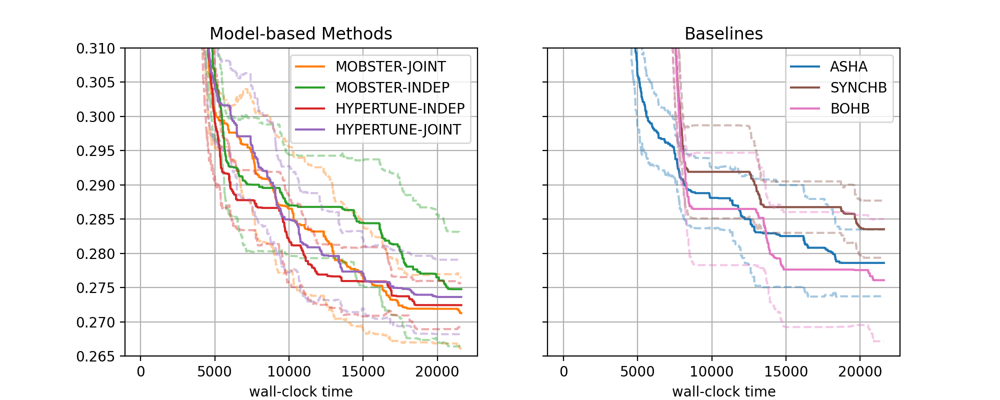

Visualization of Results over many Experiments
==============================================

Apart from troubleshooting, visualizing the results of a single experiment is
of limited use. In this section, we show how to create comparative plots,
using results of many experiment. We will use results from the study
`detailed above <single_experiment.html#a-comparative-study>`__.

A First Comparative Plot
------------------------

Here is the code for generating result plots for two of the benchmarks:

.. literalinclude:: ../../../../benchmarking/nursery/benchmark_hypertune/plot_results.py
   :caption: benchmarking/nursery/benchmark_hypertune/plot_results.py
   :start-after: # permissions and limitations under the License.

The figure for benchmark ``nas201-cifar-100`` looks as follows:

+---------------------------------------+
| |Results for nas201-cifar-100|        |
+=======================================+
| Results for NASBench-201 (CIFAR-100)  |
+---------------------------------------+

* There are two subfigures next to each other. Each contains a number of
  curves in bold, along with confidence intervals. The horizontal axis
  depicts wall-clock time, and on the vertical axis, we show the best
  metric value found until this time.
* More general, the data from our 1260 experiments can be grouped w.r.t.
  subplot, then *setup*. Each setup gives rise to one curve (bold, with
  confidence band). Subplots are optional, the default is to plot a single
  figure.
* The function ``metadata_to_setup`` maps the metadata stored for an experiment
  to the setup name, or to ``None`` if this experiment should be filtered out.
  In our basic case, the setup is simply the name of the tuning algorithm.
  Our benchmarking framework stores a host of information as metadata, the
  most useful keys for grouping are:

  * ``algorithm``: Name of method (``ASHA``, ``MOBSTER-INDEP``, ... in our example)
  * ``tag``: Experiment tag. This is ``docs-1`` in our example. Becomes useful when
    we merge data from different studies in a single figure
  * ``benchmark``: Benchmark name (``nas201-cifar-100``, ... in our example)
  * ``n_workers``: Number of workers

  Other keys may be specific to ``algorithm``.
* Once the data is grouped w.r.t. benchmark, then subplot (optional), then
  setup, we should be left with 15 experiments, one for each seed. Each seed
  gives rise to a best metric value curve. A metric value ``metric_val`` is
  converted as :code:`metric_multiplier * metric_val` if ``mode == "min"``,
  and as :code:`1 - metric_multiplier * metric_val` if ``mode == "max"``.
  For example, if your metric is accuracy in percent (from 0 to 100), then
  ``mode="max"`` and ``metric_multiplier=0.01``, and the curve shows error
  in [0, 1].
* These 15 curves are now interpolated to a common grid, and at each grid
  point, the 15 values (one for each seed) are aggregated into 3 values
  ``lower``, ``aggregate``, ``upper``. In the figure, ``aggregate`` is shown
  in bold, and ``lower``, ``upper`` in dashed. Different aggregation modes
  are supported (selected by ``plot_params.aggregate_mode``):

  * ``mean_and_ci``: Mean and 0.95 normal confidence interval
  * ``iqm_bootstrap`` (default): Interquartile mean and 0.95 confidence
    interval based on the bootstrap variance estimate. These statistics are
    argued for in `Agarwal et.al: Deep Reinforcement Learning at the Edge
    of the Statistical Precipice <https://arxiv.org/abs/2108.13264>`__.
  * ``median_percentiles``: Median and 25 (lower), 75 (upper) percentiles

* Plotting starts with the creation of a
  :class:`~syne_tune.experiments.ComparativeResults` object. We need to
  pass the experiment names (or tags), the list of all setups, the number of
  runs (or seeds), the ``metadata_to_setup`` function, as well as default
  plot parameters in ``plot_params``. See
  :class:`~syne_tune.experiments.PlotParameters` for full details about the
  latter. In our example, we set ``xlabel``, ``aggregate_mode`` (see above),
  and enable a grid with ``grid=True``. Note that these parameters can be
  extended and overwritten by parameters for each plot.
* In our example, we separate the MOBSTER and HYPERTUNE setups from the
  baselines, by using two subfigures. This is done by specifying
  ``plot_params.subplots`` and ``metadata_to_subplot``. In the former,
  ``plot_params.subplots.kwargs`` is mandatory, we need the number of
  rows ``nrows`` and columns ``ncols`` of the subplot arrangement.
  In ``plot_params.subplots.titles``, we can provide titles for each column
  (which we do here). If given, this overrides ``plot_params.title``.
  Also, ``plot_params.subplots.legend_no=[0, 1]`` asks for legends in both
  subplots (the default is no legend at all). For full details about these
  arguments, see :class:`~syne_tune.experiments.SubplotParameters`
* The creation of ``results`` does a number of things. First, if
  ``download_from_s3=True``, result files are downloaded from S3. In our
  example, we assume this has already been done. Next, all result files are
  iterated over, all ``metadata.json`` are read, and an inverse index from
  benchmark name to paths, ``setup_name``, and ``subplot_no`` is created.
  This process also checks that exactly ``num_runs`` experiments are present
  for every setup. For large studies, it frequently happens that too few
  or too many results are found. The warning outputs can be used for
  debugging.
* Given ``results``, we can create plots for every benchmark. In our example,
  this is done for ``nas201-cifar100`` and ``nas201-ImageNet16-120``, by
  calling ``results.plot()``. Apart from the benchmark name, we also pass
  plot parameters in ``plot_params``, which extend (and overwrite) those
  passed at construction. In particular, we need to pass ``metric`` and
  ``mode``, which we can obtain from the benchmark description. Moreover,
  ``ylim`` is a sensible range for the vertical axis, which is different
  for every benchmark (this is optional).
* If we pass ``file_name`` as argument to ``results.plot``, the figure is
  stored in this file.

Additional Features
-------------------

HIER: Go through all other options. Provide example code snippets, but no
figures!
